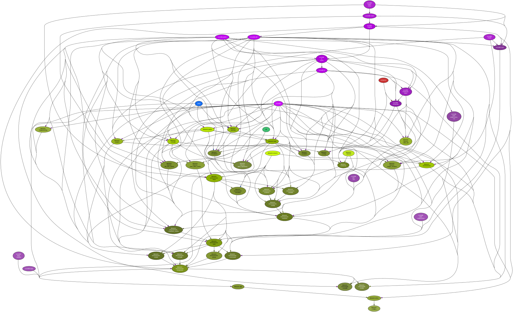

<!--
    =====================================
    generator=datazen
    version=3.1.5
    hash=05d951a1cf7e3be624f8036bce30271d
    =====================================
-->

# datazen ([3.2.0](https://pypi.org/project/datazen/))

[](https://pypi.org/project/datazen/)

[](https://codecov.io/github/vkottler/datazen)


*Compile and render schema-validated configuration data.*

## Documentation

### Generated

* By [sphinx-apidoc](https://vkottler.github.io/python/sphinx/datazen)
(What's [`sphinx-apidoc`](https://www.sphinx-doc.org/en/master/man/sphinx-apidoc.html)?)
* By [pydoc](https://vkottler.github.io/python/pydoc/datazen.html)
(What's [`pydoc`](https://docs.python.org/3/library/pydoc.html)?)

## Python Version Support

This package is tested with the following Python minor versions:

* [`python3.12`](https://docs.python.org/3.12/)
* [`python3.13`](https://docs.python.org/3.13/)

## Platform Support

This package is tested on the following platforms:

* `ubuntu-latest`
* `macos-latest`
* `windows-latest`

# Introduction

Good software is composable and configurable, but
the complexity of managing configuration data scales with its complexity.

This package simplifies data curation and partitioning for uses in rendering
templates, or just rendering final sets of serialized data.

# Manifest Schema Reference

* [Default Directories](#default-directories)
* [Manifest Includes](#manifest-includes)
* [Output Directory](#output-directory)
* [Cache Directory](#cache-directory)
* [Global Loads](#global-loads)
* [Manifest Parameters](#manifest-parameters)
* [Default Target](#default-target)
* [Compiles](#compiles)
* [Commands](#commands)
* [Renders](#renders)
* [Groups](#groups)

# Usage

```
$ ./venv3.12/bin/dz -h

usage: dz [-h] [--version] [-v] [-q] [--curses] [--no-uvloop] [-C DIR]
          [--line-ending {unix,dos,unix}] [-m MANIFEST] [-c] [--sync] [-d]
          [targets ...]

Compile and render schema-validated configuration data.

positional arguments:
  targets               target(s) to execute

options:
  -h, --help            show this help message and exit
  --version             show program's version number and exit
  -v, --verbose         set to increase logging verbosity
  -q, --quiet           set to reduce output
  --curses              whether or not to use curses.wrapper when starting
  --no-uvloop           whether or not to disable uvloop as event loop driver
  -C DIR, --dir DIR     execute from a specific directory
  --line-ending {unix,dos,unix}
                        line-ending option to use by default (default: 'unix')
  -m MANIFEST, --manifest MANIFEST
                        manifest to execute tasks from (default:
                        'manifest.yaml')
  -c, --clean           clean the manifest's cache and exit
  --sync                sync the manifest's cache (write-through) with the
                        state of the file system before execution
  -d, --describe        describe the manifest's cache and exit

```

# Manifest Schema

A manifest is provided to `datazen` to establish the set of targets
that should be executed based on defaults or the command-line invocation.

## Default Directories

A boolean flag specifying whether or not to load directories relative
to the current manifest file that coincide with names of load-able
data types (e.g. "configs" loaded as configs, "variables" loaded as
variables). By default these are loaded into the global namespace.

Setting this false will not automatically load these directories.


```
default_dirs:
  type: boolean
  default: true
```
## Manifest Includes

Include additional files to build the final, root manifest with.
This same schema applies to included files.


```
includes: paths
```
## Output Directory

Override the default output directory (i.e. `datazen-out`).

```
output_dir:
  type: string
```
## Cache Directory

Override the default cache directory (i.e. `.manifest_cache`).

```
cache_dir:
  type: string
```
## Global Loads

For each of these keys, add paths that should be loaded globally.

```
configs: paths
schemas: paths
schema_types: paths
templates: paths
variables: paths
```
## Manifest Parameters

Manifests themselves are
[Jinja](https://jinja.palletsprojects.com/en/2.11.x/) templates that are
rendered with the data contained in this key.


```
params:
  type: dict
```
## Default Target

The target to execute by default if none is provided.

```
default_target:
  type: string
```
## Compiles

Target definitions for compilation tasks.

```
compiles:
  type: list
  schema:
    type: dict
    schema:
      configs: paths
      schemas: paths
      schema_types: paths
      variables: paths
      dependencies: deps
      name:
        type: string
      key:
        type: string
      override_path:
        type: string
      output_type:
        type: string
      output_path:
        type: string
      output_dir:
        type: string
      index_path:
        type: string
      merge_deps:
        type: boolean
        default: false
      append:
        type: boolean
```
## Commands

Target definitions for command-line command tasks.

```
commands:
  type: list
  schema:
    type: dict
    schema:
      file:
        type: string
      name:
        type: string
      command:
        type: string
      force:
        type: boolean
      replace_newlines:
        type: boolean
      arguments: deps
      dependencies: deps
```
## Renders

Target definitions for render tasks. Renders can create output files
based on [Jinja](https://jinja.palletsprojects.com/en/2.11.x/) templates,
or just String data to be used as a dependency for another task.


```
renders:
  type: list
  schema:
    type: dict
    schema:
      templates: paths
      children: deps
      child_delimeter:
        type: string
      child_indent:
        type: integer
      dependencies: deps
      name:
        type: string
      override_path:
        type: string
      as:
        type: string
      key:
        type: string
      output_dir:
        type: string
      output_path:
        type: string
      no_dynamic_fingerprint:
        type: boolean
      no_file:
        type: boolean
      indent:
        type: integer
      template_dependencies:
        type: list
        schema:
          type: string
```
## Groups

Target definitions for group tasks. Groups declare a set of dependencies
and nothing else. Groups can be used as dependencies for any other target.


```
groups:
  type: list
  schema:
    type: dict
    schema:
      name:
        type: string
      dependencies: deps
```

# Manifest Schema Types

These items may appear in the manifest schema.

## deps

Dependencies are lists of Strings.
They should be formatted as `(compiles,renders,...)-target`.


```
type: list
schema:
  type: string
```
## paths

Paths are lists of Strings and can use `/` or `\\` as delimeters.
Paths are relative to the directory that a manifest file is in, but for
manifest includes, all "loaded" directories are relative to the root
manifest's directory. Paths can also be absolute.


```
type: list
schema:
  type: string
```

# Internal Dependency Graph

A coarse view of the internal structure and scale of
`datazen`'s source.
Generated using [pydeps](https://github.com/thebjorn/pydeps) (via
`mk python-deps`).



*This entire document is generated by this package.*
